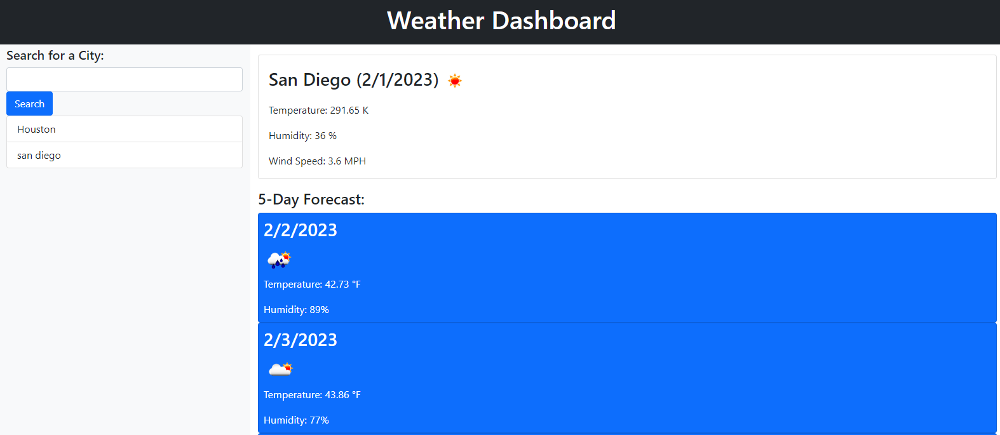

# Week 6 Challenge: Weather Dashboard
## Description
The goal of this challenge was to build a weather dashboard using Javascript to fetch from the Open Weather API and then display that data properly in the dashboard.
## The challenge of this Challenge
The challenging aspect of this assignment was figuring out how to handle to data that returns from the API fetch. It was a challenge to figure out how to access the right thing and then get that to display properly.
## Criteria Met
I made the pretty simple page based on the screenshot provided in the class assets.  The current day does display with the locations weather, and the cities searched are saved in local storage.
## Link to Deployed Application
https://bsidemyself.github.io/sshackleton-week6-challenge/
## Screenshot

## References
This site helped me figure some of the fetching and what to do with what returns
https://www.educative.io/answers/how-to-create-a-simple-weather-application-with-html-css-and-js
